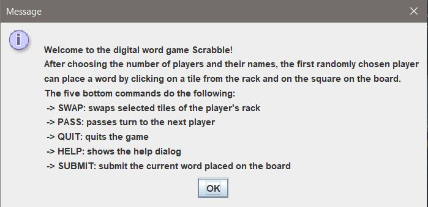

# WordTileGame
A Java project that uses the [MVC design pattern](https://developer.mozilla.org/en-US/docs/Glossary/MVC) to simulate a tile-based word game, allowing players and/or bots to form words and earn points in a turn-based format.

## Description
Our program is a GUI-based playable version; the user input is via the mouse and keyboard. Unit tests for the Model have been added, and they all pass. The controllers available include choosing names and number of AI players, displaying the state of the active player, allowing players to place a word by clicking on the tile rack letter and on the board square, changing tiles on the rack with new ones from the tile pile, passing turns, quitting the game, submitting placed tiles, saving or loading the game, and asking for help. Events such as error messages, game end, help dialogues, file selection dialogues, etc. are displayed when needed.  
- [Sequence Diagrams](https://github.com/UMNIYAH/WordTile/tree/main/Sequence%20Diagrams)
- [UML Design](https://github.com/UMNIYAH/WordTile/blob/main/UML.jpg)     

## Usage
The welcome message is displayed and followed by input dialogues to enter the number of players, number of AI players, names of players, and version. The board, player's rack, commands, and active player name and score are all displayed and the game can be played. The menu bar has two items: File and Edit. Accessing the file gives the option to save or load the game. Simply click on one of the options and follow the prompts.  
The commands available for the player to click on are as follows: 
SWAP: changing the tiles on the rack (from the player) with new ones from the tile pile; the player selects the tiles and clicks on SWAP for the tiles to be swapped. 
PASS: passes the active player's turn to the next solvent player - the game terminates after all players pass twice. 
QUIT: displays a goodbye message and quits the game. 
HELP: displays placement specifications and commands usage. 
SUBMIT: submits the letters placements.

## Step-by-Step Guide: How to play
1. Execute the JAR file from the command line using "java -jar WordTile.jar"  

2. Input dialogues:  
Select the number of players (2-4 players allowed).     
Select the number of AI players.     
Select the names of players (human players only).      
Select the board (original or custom); select the modifiable XML for the custom version.     

3. Play WordTile! Place a tile on the board by clicking on the tile from the rack and onto the board.
   

4. Save or load the game when needed. The features are under the -File- menu bar option.
 
5. Winners and their scores are announced at the end of the game.     

Do not forget to ask for help when needed; have fun!

## Known issues
The code functions properly and the tests run; therefore, there are no known issues with the current iteration. 

## Roadmap ahead
This is the final iteration of the project and no further updates will be added.

## Authors
Umniyah Mohammed, Tuna Uygun, and Hasan Al-Hasoo.

## Disclaimer
All assets and code in this repository were created solely for educational and non-commercial purposes.
